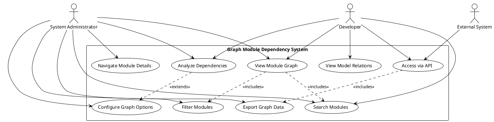
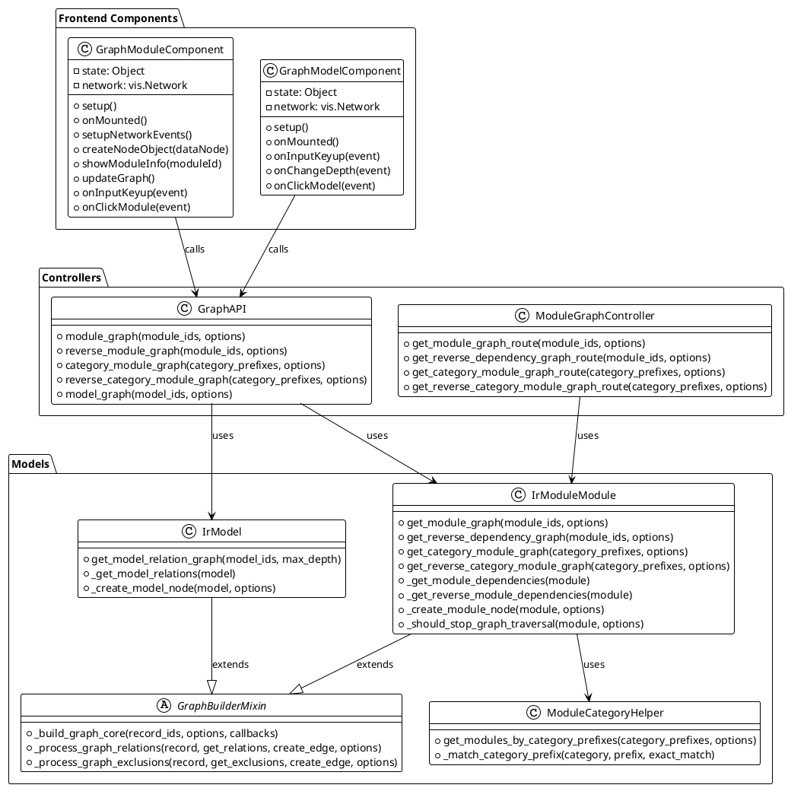
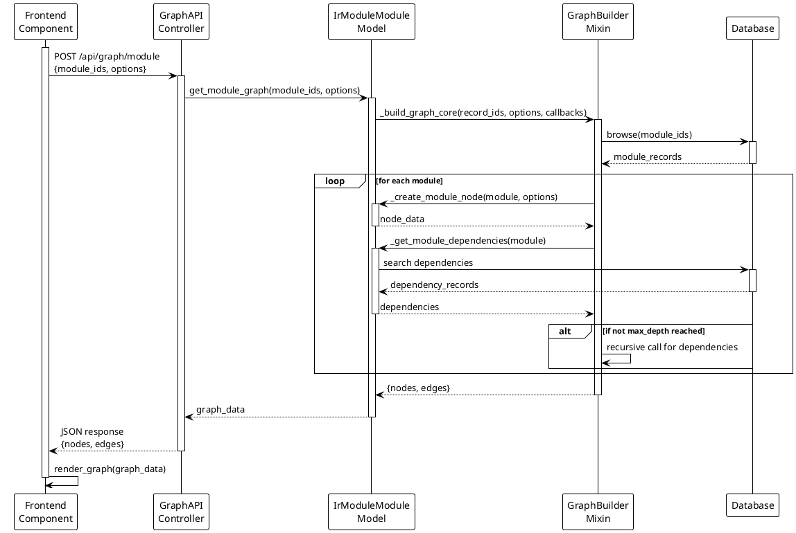
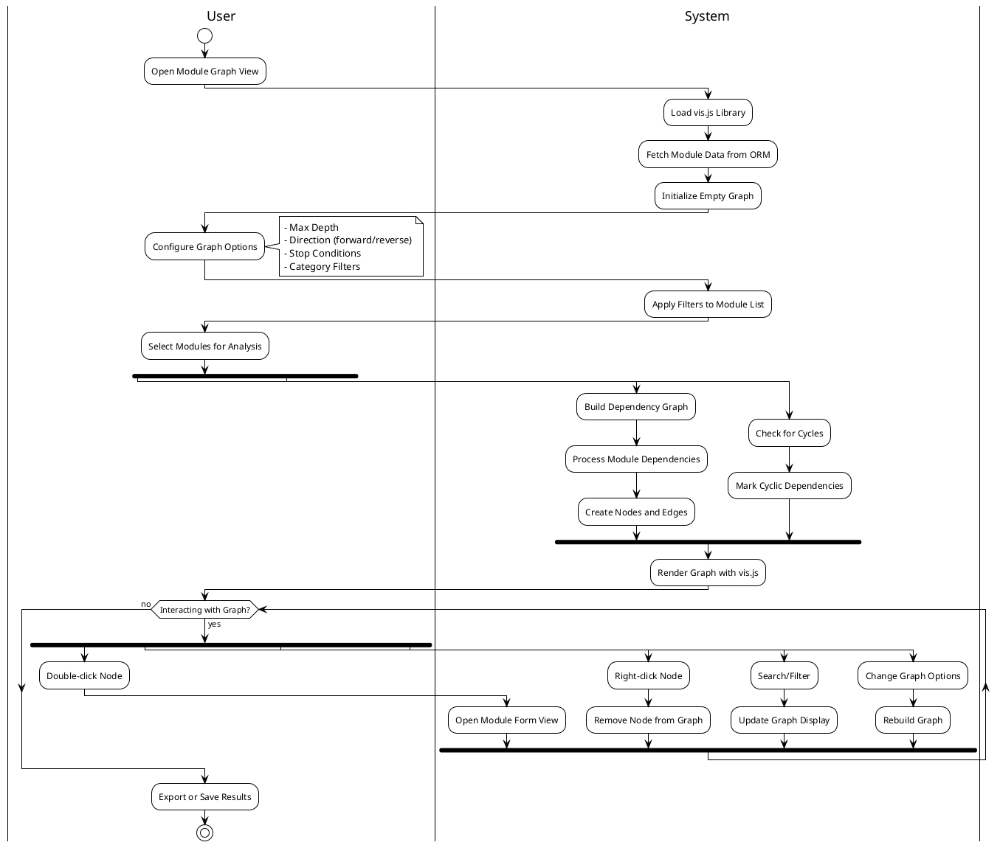
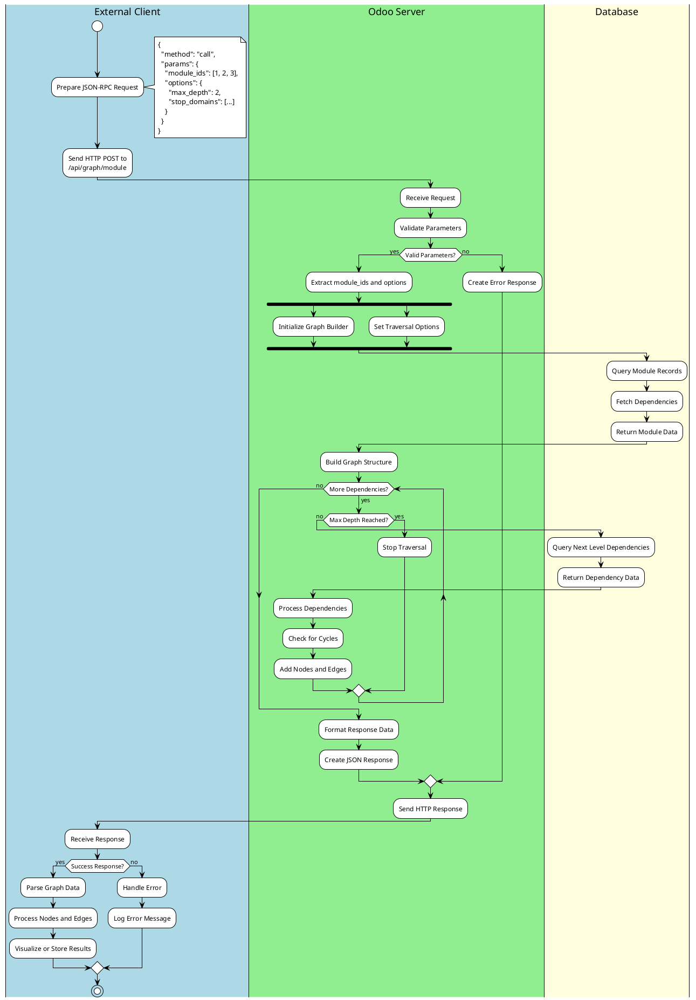

# UML Diagrams for Softifi Graph Module Dependency

This document contains UML diagrams that illustrate the architecture, workflows, and interactions within the Softifi Graph Module Dependency Odoo module.

## 1. Use Case Diagram

## 2. Class Diagram

## 3. Sequence Diagram - Module Graph Generation

## 4. Activity Diagram - Graph Visualization Workflow

## 5. Activity Diagram with Pools - API Request Processing

## Diagram Descriptions

### Use Case Diagram
Shows the main actors (System Administrator, Developer, External System) and their interactions with the graph module dependency system. Key use cases include viewing graphs, analyzing dependencies, filtering modules, and accessing data via API.

### Class Diagram
Illustrates the main classes and their relationships across three packages:
- **Controllers**: Handle HTTP requests and route them to appropriate models
- **Models**: Contain business logic for graph generation and data processing
- **Frontend Components**: Manage user interface and visualization

### Sequence Diagram
Details the flow of a typical module graph generation request, showing interactions between frontend, API controller, model classes, and database.

### Activity Diagrams
1. **Graph Visualization Workflow**: Shows the complete user workflow from opening the graph view to interacting with the visualization
2. **API Request Processing**: Demonstrates the server-side processing of API requests with pools showing different system layers
